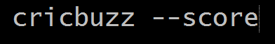
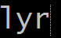

# Utlyz

Utlyz is an application that works on the command line and makes life easier for you.
If you want to check the score of all ongoing matches in cricket or want to check if you got any new friend requests or notifications on FB, Utlyz is the right application for you! Follow the steps on [`INSTALL.md`](https://github.com/rahulkumaran/Utlyz-CLI/blob/master/docs/INSTALL.md) to install this and run it on your laptop or dekstop.

Currently, Utlyz supports 8 things:
1) Facebook Access
2) Checking cricket scores and schedules (from Cricbuzz)
3) Getting lyrics of songs
4) Searching on google and wikipedia
5) Checking news bulletins (from reuters)
6) Checking football scores (from Goal.com)
7) Allows you to have access to random XKCD images in a separate XKCD directory.
8) Doing basic calculations.
---

- ## FacebookCLI

  

  Let's you to access your FB account from the command line and returns various things number of *unread notifications*,
*messages* or *friend requests* you have.

- ## Cricket Updates

  

  Let's you to check score updates and cricket schedules of the current month from your command line itself.

- ## Lyrics

  

  Let's you get the lyrics of *whatever* song you want. All you need to do is, enter the name of the song after typing in the comannd, and **💥BOOM!💥** You have your song's lyrics in front of you on the command line.

- ## Searching

  Let's you to access google and wikipedia from the command line itself! All you need to do is type the --google or --wiki options to do a google search or a wiki search. After typing the commands, you'll be prompted to enter the topic you want to search about.
If you do a Google search, it'll display the most popular links related to that particular topic. Just clicking on the link will redirect you to the browser.
  >Note : In case of a wiki search, the entire *wikipedia* data is displayed on the command line apart from tables and images.

- ## News

  

  Let's you get the access to the latest news bulletins from reuters directly on your command line.

- ## Football

  

  Let's you get scores of the ongoing matches and matches that just got over on that particular day.

- ## XKCD

  

  Downloads random *XKCD* images for you to read in the directory *XKCD* inside the Utlities folder in your local repository(Laptop or Desktop).

- ## Calculator

  

  Let's you add, subtract, multiply, divide or find the modulus of two numbers.
  
---

The functionalities it currently supports are:
	
	1) Facebook updates
	--fr			Gives the number of new friend requests you have
	--msg			Gives the number of unread messages you have
	--notifs		Gives the number of unseen notifications you have
	--bdays			Gives the list of all those people who have their birthday on that particular day
	
	2) Cricket updates
	--score			Gives the scores of all ongoing and recently finished matches
	--schedule		Gives the schedule of all international matches throughout the ongoing month
	
	3) Lyrics
	--lyr			Gives the lyrics of the song you enter after executing the command
	
	4) Searching
	--google		Gives the links of the most popular sites visited w.r.t a particular topic
	--wiki			Gives the whole wikipedia information regarding a topic on the Command Line itself
	
	5) News
	--trending		Gives you trending news topics
	
	6) Football
	--scores		Gives you the scores of the matches
	
	7) XKCD
	--image			Allows you to download XKCD images
    
    8) Calculator
    --add			Allows you to add two numbers
	--sub			Allows you to subtract two numbers
    --mul			Allows you to multiply two numbers
    --div			Allows you to divide two numbers
    --mod			Allows you to find modulus of two numbers

> It's a project in it's *budding stage* currently and you're most welcome to create issues and PR's. Your comments would be *valuable*! Please *fork* and *clone* the repository and run it in your virtual environment.
>
> Note : Utylz works best with **Ubuntu**
